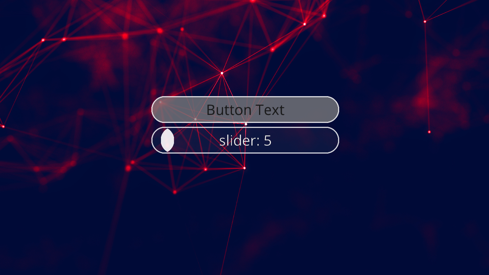

# [Jpize](https://github.com/GeneralPashon/jpize-engine) - Java Game Engine


### The Engine focuses on being:
* *Intuitive*
* *Simple*
* *Efficient*

### Support OS:
* *Windows*
* *Linux x64*
* *MacOS*

---

## Demos
* *[Demo Repository](https://github.com/GeneralPashon/jpize-demos)*
* *[Minecraft Open Source Edition](https://github.com/GeneralPashon/minecraft-open-source-edition)*

## Libraries: 
* *[libsdl4j](https://github.com/libsdl4j/libsdl4j)* - SDL2
* *[lwjgl3](https://github.com/LWJGL/lwjgl3)* - OpenGL, OpenAL, STB
* *[joribs](https://github.com/ymnk/jorbis)* - OGG
* *[jlayer](https://github.com/umjammer/jlayer)* - MP3

## Forks
* *[Kotlin Fork](https://github.com/Raf0707/Pizza-Engine-Kotlin)* by *[Raf0707](https://github.com/Raf0707)*
* *[C++ Version](https://github.com/GeneralPashon/Pizza-Engine-Cpp)* (In Dev)

---

# Getting Started

---

## Modules:
* *Core*
* *Net*
* *Physic*
* *UI*

---

## Module *Core*:
* *[Audio](https://github.com/GeneralPashon/jpize-engine/tree/master/core/src/main/java/jpize/audio)* - OGG, MP3, WAV
* *[Graphics](https://github.com/GeneralPashon/jpize-engine/tree/master/core/src/main/java/jpize/graphics)* - Camera, Fonts, Postprocessing ...
* *[Maths](https://github.com/GeneralPashon/jpize-engine/tree/master/core/src/main/java/jpize/math)* - Vectors, Matrices ...
* *[Utils](https://github.com/GeneralPashon/jpize-engine/tree/master/core/src/main/java/jpize/util)* - Resources, FastReader, Stopwatch, Jpize IO Streams ...

#### 1. Main class
``` java
public class App extends JpizeApplication{

    public static void main(String[] args){
        // Create window context
        ContextBuilder.newContext(1280, 720, "Window Title")
                .icon("icon.png")
                .register()
                .setAdapter(new App());
                
        // Run created contexts
        Jpize.runContexts();
    }
    
    public App(){ } // Constructor calls before init()
    
    public void init(){ } // Init
    
    public void render(){ } // Render loop
    
    public void update(){ } // Update loop
    
    public void resize(int widht, int height){ } // Calls when window resizes
    
    public void dispose(){ } // Exit app
    
}
```

#### 2. 2D Graphics:
``` java
TextureBatch batch = new TextureBatch(); // canvas for textures
Texture texture = new Texture("texture.png");

Gl.clearColorBuffer();
batch.begin();

// rotate, shear and scale for subsequent textures
batch.rotate(angle);
batch.shear(angle_x, angle_y);
batch.scale(scale);
// texture drawing
batch.draw(texture, x, y, width, height);

batch.end();
```

#### 3. Fonts:
``` java
// load
BitmapFont font = FontLoader.getDefault();

BitmapFont font = FontLoader.loadFnt(path_or_resource);

BitmapFont font = FontLoader.loadTrueType(path_or_resource, size);
BitmapFont font = FontLoader.loadTrueType(path_or_resource, size, charset);

// options
FontOptions options = font.getOptions();

options.scale = 1.5F;
options.rotation = 45;
options.italic = true;
options.invLineWrap = true;

// bounds
float width = font.getLineWidth(line);
float height = font.getTextHeight(text);
Vec2f bounds = font.getBounds(text);

// render
font.drawText(batch, text, x, y)
```

#### 4. Input:
``` java
// mouse
Jpize.getX()  // position
Jpize.getY()

Jpize.isTouched()    // touch
Jpize.isTouchDown()
Jpize.isTouchReleased()

Jpize.input().getScroll()  // scroll

Btn.LEFT.isDown()     // buttons
Btn.LEFT.isPressed()
Btn.LEFT.isReleased()

// keyboard
Key.ENTER.isPressed()
Key.ESCAPE.isDown()
Key.SPACE.isReleased()

// window
Jpize.getWidth()
Jpize.getHeight()
Jpize.getAspect()

// monitor
Jpize.monitor()         // window monitor
Jpize.primaryMonitor()  // primary monitor

// FPS & Delta Time
Jpize.getFPS()
Jpize.getDt()
Jpize.setFixedUpdateTPS(update_rate)
Jpize.getFixedUpdateDt()
```

#### 5. Audio:
``` java
// sound
Sound sound = new Sound("sound.mp3");

sound.setVolume(0.5F);
sound.setLooping(true);
sound.setPitch(1.5F);

sound.play();

// buffers and sources
AudioBuffer buffer = new AudioBuffer();
AudioLoader.load(buffer, resource);

AudioSource source = new AudioSource();
source.setBuffer(buffer);
source.play();
```

#### 6. Resources:
``` java
// internal / external
Resource res = new Resource(path, true); // external
Resource res = new Resource(path); // internal

res.isExternal()
res.isInternal()


// as file
Resource res = new Resource("file.ext");

res.getExtension()  // returns 'ext' of 'file.ext'
res.getSimpleName() // returns 'file' of 'file.ext'

res.getFile()
res.exists()

res.mkDirsAndFile()
res.mkParentDirs()

// io
res.inStream()
res.outStream()

res.getJpizeIn()  // JpizeInputStream
res.getJpizeOut() // JpizeOutputStream

res.getReader()  // FastReader
res.getWriter()  // PrintStream

// write/read
res.writeString(text)
res.appendString(text)

res.readString()
res.readBytes()
res.readByteBuffer()  // ByteBuffer


// resources (images, sounds, fonts, ...etc)
Resource res = new Resource( ... );

new Texture(res);
new Sound(res);
new Shader(res_vert, res_frag);
AudioLoader.load(audio_buffer, res);
FontLoader.loadFnt(res);
PixmapIO.load(res);
```

---

## Module *Net*:
* *[Security](https://github.com/GeneralPashon/jpize-engine/tree/master/net/src/main/java/jpize/net/security)* - AES, RSA
* *[TCP](https://github.com/GeneralPashon/jpize-engine/tree/master/net/src/main/java/jpize/net/tcp)* - Packets, Server / Client
* *[UDP](https://github.com/GeneralPashon/jpize-engine/tree/master/net/src/main/java/jpize/net/udp)* - Server / Client

#### 1. Encrypted Server-Client Example:
``` java
KeyAES key = new KeyAES(128); // generate key for connection encoding

// server
TcpServer server = new TcpServer(new TcpListener(){
    public void received(byte[] bytes, TcpConnection sender){
        System.out.printf("received: %f\n", new String(bytes)); // 'received: Hello, World!'
    }
    public void connected(TcpChannel channel){
        channel.encrypt(key);
    }
    public void disconnected(TcpChannel channel){ ... }
});
server.run("localhost", 8080);

// client
TcpClient client = new TcpClient(new TcpListener(){ ... });
client.connect("localhost", 8080);
client.encrypt(key);
client.send("Hello, World!".getBytes()); // send 'Hello, World!'
```

#### 2. Packet Example:
``` java
// Packets Handler
class MyPacketHandler implements PacketHandler{

    public void handleMyPacket(MyPacket packet){ ... }
    
    public void handleAnotherPacket(AnotherPacket packet){ ... }
}

// Packet
class MyPacket extends IPacket<MyPacketHandler>{ // MyPacketHandler
    public static final int PACKET_ID = /*Your packet ID*/;
    
    public MyPacket(){
        super(PACKET_ID);
    }
    public MyPacket(some_data){
        this();
        ...
    }

    public void write(JpizeOutputStream outStream){ ... } // write data when sending
    public void read(JpizeInputStream inStream){ ... } // read data when receivind

    public void handle(MyPacketHandler handler){ // handle this packet
        handler.handleMyPacket(this); 
    }
}


// packet sending
TcpConnection connection = ...;
connection.send(new MyPacket(some_data));

// packet receiving
MyPacketHandler handler = ...;
// register packets
PacketDispatcher packetDispatcher = new PacketDispatcher();
packetDispatcher.register(MyPacket     .PACKET_ID, MyPacket     .class);
packetDispatcher.register(AnotherPacket.PACKET_ID, AnotherPacket.class);
...
void received(byte[] bytes, TcpConnection sender){
    packetDispatcher.handlePacket(bytes, handler);
}
```

---

## Module *Physic*:
* *[Axis-Aligned](https://github.com/GeneralPashon/jpize-engine/tree/master/physic/src/main/java/jpize/physic/axisaligned)* - Box, Rect & Collider
* *[Utils](https://github.com/GeneralPashon/jpize-engine/tree/master/physic/src/main/java/jpize/physic/utils)* - Velocity, Intersector, Ray

#### 1. AABB Collider Example:
``` java
AABoxBody body_1 = new AABoxBody( new AABox(-1,-1,-1,  1, 1, 1) ); // 2x2x2 axis-aligned box
AABoxBody body_2 = new AABoxBody( new AABox(-1,-1,-1,  1, 1, 1) ); // another axis-aligned box

body_1.getPosition().set(-5F, 0, 0);

Vec3f b1_velocity = new Vec3f(10F, 0, 0);
velocity = AABoxCollider.getCollidedMovement(b1_velocity, body_1, body_2);

body_1.getPosition().add( b1_velocity ); // box will be move only 3 units
```

---

## Module *UI*:
* *[UIComponent](ui/src/main/java/jpize/ui/component/UIComponent.java)* - Base component class
* *[Constraint](ui/src/main/java/jpize/ui/constraint)* - Pixel, Relative, Aspect, Flag (Used to determine the static or dynamic position and size of ui components)
* *[AbstractLayout](ui/src/main/java/jpize/ui/component/AbstractLayout.java)* - implemented in: ConstraintLayout, VBox, HBox

#### 1. UI Java Example:
``` java
// context
UIContext ui = new UIContext();

// Layout
AbstractLayout layout = new VBox(Constr.win_width, Constr.win_height);
ui.setRootComponent(layout);

// Button
Button button = new Button(Constr.aspect(10), Constr.px(100), "Button Text", font);
button.padding().set(Constr.relh(0.35), Constr.zero, Constr.auto, Constr.zero);

// Slider
Slider slider = new Slider(Constr.aspect(10), Constr.px(100), "Slider: 0", font);
slider.padding().set(Constr.px(10), Constr.zero, Constr.auto, Constr.zero);

// Add to layout Button & Slider
layout.add(button);
layout.add(slider);

// Callbacks
button.input().addPressCallback((component, button, action) -> {
    System.out.println("Press Button");
});
button.input().addReleaseCallback((component, button, action) -> {
    System.out.println("Release Button");
});

slider.addSliderCallback(((component, value) -> {
    component.textview().setText("Slider: " + Maths.round(value * 100));
}));

// Render
ui.render();

// Dispose
ui.dispose();

// Enables/Disables touch & resize handling (disabled by defalut)
ui.enable();
ui.disable();
```

#### 2. [PUI Markup Language](https://github.com/GeneralPashon/jpize-ui-idea-plugin) Example:
#### Java:
``` java
// resources
Texture bg_0 = new Texture("ui/bg_0.jpg");
BitmapFont font = FontLoader.getDefault();
font.setScale(0.8F);

// load context
UILoader loader = new UILoader()
    .putRes("font", font)
    .putRes("layout:bg_0", bg_0)
    .putRes("button:aspect", Constr.aspect(7))
    .addComponentAlias("Btn", Button.class);

UIContext ui = loader.loadRes("view_file.pui");
ui.enable();

// callbacks
Button button = ui.getByID("button");
Slider slider = ui.getByID("slider");

button.input().addPressCallback((component, btn) -> component.style().background().color().setRgb(0.75));
button.input().addReleaseCallback((component, btn) -> component.style().background().color().setRgb(0.5));

slider.addSliderCallback(((component, value) -> {
    slider.textview().setText("Slider: " + Maths.round(value * 100));
    slider.textview().color().setRgb(1 - value);
    component.style().background().color().setA(value);
}));

...
```
#### PUI File:
``` pui
@VBox {
    style.background.image: !layout:bg_0

    @Btn (!button:aspect, 70px, 'Button Text', !font) {
        ID: 'button'
        padding: (0.35rh, zero, auto, zero)
        style: {
            background.color: (0.5, 0.5, 0.5, 0.75)
            border_size: 3px
            border_color: (1.0, 1.0, 1.0, 0.9)
            corner_radius: 35px
        }
    }

    @Slider (7ap, 70px, 'Slider: 0', !font) {
        ID: 'slider'
        padding: (10px, 0px, auto, 0px)
        style: {
            background.color.a: 0
            border_size: 3px
            border_color: (1.0, 1.0, 1.0, 0.9)
            corner_radius: 35px
        }
        handle.style: {
            background.color: (1.0, 1.0, 1.0, 0.9)
            corner_radius: 35px
        }
        textview.color: (1, 1, 1, 1)
    }
}
```
#### Result: 

---

## Bugs and Feedback
For bugs, questions and discussions please use the [GitHub Issues](https://github.com/GeneralPashon/jpize-engine/issues).
