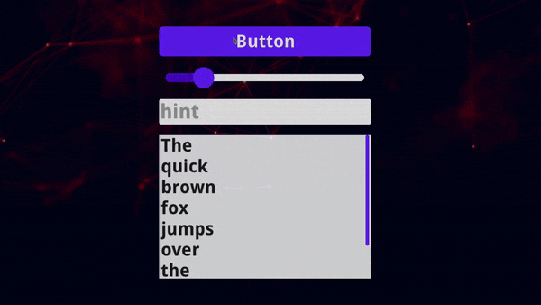

# [Jpize](https://github.com/generaloss/jpize-engine) - Java Game Engine


### The Engine focuses on being:
* **Intuitive**
* **Simple**
* **Efficient**

### Support OS:
* **Windows**
* **Linux x64**
* _(possibly MacOS)_

---

## Demos
* *[Demo Repository](https://github.com/generaloss/jpize-demos)*
* *[Minecraft Open Source Edition](https://github.com/generaloss/minecraft-open-source-edition)*

## Libraries: 
* *[libsdl4j](https://github.com/libsdl4j/libsdl4j)* - SDL2
* *[lwjgl3](https://github.com/LWJGL/lwjgl3)* - OpenGL, OpenAL, STB
* *[joribs](https://github.com/ymnk/jorbis)* - OGG
* *[jlayer](https://github.com/umjammer/jlayer)* - MP3

## Forks
* *[Kotlin Fork](https://github.com/Raf0707/Pizza-Engine-Kotlin)* by *[Raf0707](https://github.com/Raf0707)*
* *[C++ Version](https://github.com/generaloss/Pizza-Engine-Cpp)* (abandoned)

---

# Getting Started

### Installing
#### Maven
```
<!-- Jpize Core -->
<dependency>
    <groupId>io.github.generaloss</groupId>
    <artifactId>jpize-core</artifactId>
    <version>24.2.1</version>
</dependency>
<!-- Jpize Utils -->
<dependency>
    <groupId>io.github.generaloss</groupId>
    <artifactId>jpize-utils</artifactId>
    <version>24.2.1</version>
</dependency>
<!-- Jpize UI -->
<dependency>
    <groupId>io.github.generaloss</groupId>
    <artifactId>jpize-ui</artifactId>
    <version>24.2.1</version>
</dependency>
<!-- Jpize Net -->
<dependency>
    <groupId>io.github.generaloss</groupId>
    <artifactId>jpize-net</artifactId>
    <version>24.2.1</version>
</dependency>
<!-- SDL -->
<dependency>
    <groupId>io.github.libsdl4j</groupId>
    <artifactId>libsdl4j</artifactId>
    <version>2.28.4-1.6</version>
</dependency>
<!-- Jorbis (OGG) -->
<dependency>
    <groupId>org.jcraft</groupId>
    <artifactId>jorbis</artifactId>
    <version>0.0.17</version>
</dependency>
<!-- JLayer (MP3) -->
<dependency>
    <groupId>javazoom</groupId>
    <artifactId>jlayer</artifactId>
    <version>1.0.1</version>
</dependency>
<!-- LWJGL -->
<dependency><groupId>org.lwjgl</groupId><artifactId>lwjgl</artifactId><version>3.3.3</version></dependency>
<dependency><groupId>org.lwjgl</groupId><artifactId>lwjgl</artifactId><version>3.3.3</version><classifier>natives-linux</classifier></dependency>
<dependency><groupId>org.lwjgl</groupId><artifactId>lwjgl</artifactId><version>3.3.3</version><classifier>natives-macos</classifier></dependency>
<dependency><groupId>org.lwjgl</groupId><artifactId>lwjgl</artifactId><version>3.3.3</version><classifier>natives-windows</classifier></dependency>
<dependency><groupId>org.lwjgl</groupId><artifactId>lwjgl-openal</artifactId><version>3.3.3</version></dependency>
<dependency><groupId>org.lwjgl</groupId><artifactId>lwjgl-openal</artifactId><version>3.3.3</version><classifier>natives-linux</classifier></dependency>
<dependency><groupId>org.lwjgl</groupId><artifactId>lwjgl-openal</artifactId><version>3.3.3</version><classifier>natives-macos</classifier></dependency>
<dependency><groupId>org.lwjgl</groupId><artifactId>lwjgl-openal</artifactId><version>3.3.3</version><classifier>natives-windows</classifier></dependency>
<dependency><groupId>org.lwjgl</groupId><artifactId>lwjgl-opengl</artifactId><version>3.3.3</version></dependency>
<dependency><groupId>org.lwjgl</groupId><artifactId>lwjgl-opengl</artifactId><version>3.3.3</version><classifier>natives-linux</classifier></dependency>
<dependency><groupId>org.lwjgl</groupId><artifactId>lwjgl-opengl</artifactId><version>3.3.3</version><classifier>natives-macos</classifier></dependency>
<dependency><groupId>org.lwjgl</groupId><artifactId>lwjgl-opengl</artifactId><version>3.3.3</version><classifier>natives-windows</classifier></dependency>
<dependency><groupId>org.lwjgl</groupId><artifactId>lwjgl-stb</artifactId><version>3.3.3</version></dependency>
<dependency><groupId>org.lwjgl</groupId><artifactId>lwjgl-stb</artifactId><version>3.3.3</version><classifier>natives-linux</classifier></dependency>
<dependency><groupId>org.lwjgl</groupId><artifactId>lwjgl-stb</artifactId><version>3.3.3</version><classifier>natives-macos</classifier></dependency>
<dependency><groupId>org.lwjgl</groupId><artifactId>lwjgl-stb</artifactId><version>3.3.3</version><classifier>natives-windows</classifier></dependency>
```

### Honorable mention
*  Matrices indexed with _**mᵢⱼ**_, where _**i**_ - column index, _**j**_ - row index
*  Left-Hand Coordinate System

---

## Modules:

| **Module** | **Depends** |
|------------|-------------|
| _**Util**_ | -           |
| _**Core**_ | util        |
| _**Net**_  | util        |
| _**UI**_   | core        |

---

## Module *Util*:
* *[Maths](https://github.com/generaloss/jpize-engine/tree/master/util/src/main/java/jpize/util/math)* - Vectors, Matrices, Utils, Velocity, Intersector, Ray, Axis-Aligned Box & Rect, Colliders, etc...
* *[Arrays](https://github.com/generaloss/jpize-engine/tree/master/util/src/main/java/jpize/util/array)* - IntList, FloatList, [...], ArrayUtils, ArraysSupport (Java 17)
* *[Files](https://github.com/generaloss/jpize-engine/tree/master/util/src/main/java/jpize/util/file)* - Resource, [...], MapConfig
* *[IO](https://github.com/generaloss/jpize-engine/tree/master/util/src/main/java/jpize/util/io)* - FastReader, Jpize IO Streams ...
* *[Colors](https://github.com/generaloss/jpize-engine/tree/master/util/src/main/java/jpize/util/color)* - IColor, Color, ImmutableColor
* *[Time](https://github.com/generaloss/jpize-engine/tree/master/util/src/main/java/jpize/util/time)* - Stopwatch, Sync, TickGenerator, FpsCounter, DeltaTimeCounter, [...]
* *[Streams](https://github.com/generaloss/jpize-engine/tree/master/util/src/main/java/jpize/util/stream)* - FloatSupplier
* *[Other](https://github.com/generaloss/jpize-engine/tree/master/util/src/main/java/jpize/util)* - Utils, StringUtils, SyncTaskExecutor

### 1. Average usage:
``` java
// Utils
EulerAngles rotation = new EulerAngles(45, 0, 0);

Vec3f direction = rotation.getDir();
Vec3f position = new Vec3f(1, 2, 3);

Matrix4f projection = new Matrix4f()
    .setPerspective(Jpize.getAspect(), 0.1F, 1000F, 70);

Matrix4f view = new Matrix4f()
    .setLookAt(position, direction);

// Core
Shader shader = new Shader(Resource.internal("shader.vsh"), Resource.internal("shader.fsh"));
shader.bind();
shader.uniform("u_view", view);
shader.uniform("u_projection", projection);

Mesh mesh = new Mesh(new GlVertAttr(3, GlType.FLOAT), new GlVertAttr(4, GlType.FLOAT));
mesh.getBuffer().setData(new float[]{ ... });
mesh.render();
```

### 2. AABB Collider Example:
``` java
AABoxBody body_1 = new AABoxBody( new AABox(-1,-1,-1,  1, 1, 1) ); // 2x2x2 axis-aligned box
AABoxBody body_2 = new AABoxBody( new AABox(-1,-1,-1,  1, 1, 1) ); // another axis-aligned box

body_1.getPosition().set(-5F, 0, 0);

Vec3f b1_velocity = new Vec3f(10F, 0, 0);
b1_velocity = AABoxCollider.getCollidedMovement(b1_velocity, body_1, body_2);

body_1.getPosition().add( b1_velocity ); // box will be move only 3 units
```

---

### 1. Vectors:
| **Type**     | **2D**  | **3D**  | **4D**  |
|--------------|---------|---------|---------|
| _**Double**_ | _Vec2d_ | _Vec3d_ | _Vec4d_ |
| _**Float**_  | _Vec2f_ | _Vec3f_ | _Vec4f_ |
| _**Int**_    | _Vec2i_ | _Vec3i_ | _Vec4i_ |

#### Available operations:
| _**Operations**_                                                        | **Description**                                                        | **Has 2D** | **Has 3D** | **Has 4D** | **Has Int** |
|-------------------------------------------------------------------------|------------------------------------------------------------------------|------------|------------|------------|-------------|
| **add, sub, mul, div**                                                  | Addition, Subtraction, Multiplication, Division                        | ✔️         | ✔️         |            | ✔️          |
| **set**                                                                 | Sets new value                                                         | ✔️         | ✔️         | ✔️         | ✔️          |
| **dst**                                                                 | Returns distance between vectors                                       | ✔️         | ✔️         |            | ✔️          |
| **min, max**                                                            | Returns a vector with greater\|less length                             | ✔️         | ✔️         |            | ✔️          |
| **len, len2, lenh**                                                     | Returns length \| squared length \| horizontal length                  | ✔️         | ✔️         |            | ✔️          |
| **nor**                                                                 | Normalize vector                                                       | ✔️         | ✔️         |            |             |
| **abs**                                                                 | Applies Math.abs() to each vector component                            | ✔️         | ✔️         |            | ✔️          |
| **zero, isZero**                                                        | Sets to zero \| Returns true is components equals zero                 | ✔️         | ✔️         |            | ✔️          |
| **zeroThatLess, zeroThatZero, zeroThatBigger**                          | Sets to zero components that is less\|zero\|bigger argument components | ✔️         | ✔️         |            | ✔️          |
| **dot**                                                                 | Returns dot product                                                    | ✔️         | ✔️         |            | ✔️          |
| **crs**                                                                 | Returns cross product                                                  | ✔️         | ✔️         |            | ✔️          |
| **rotX, rotY, rotZ**                                                    | Rotate point around axis                                               |            | ✔️         |            |             |
| **frac**                                                                | Returns fractional part                                                | ✔️         | ✔️         |            |             |
| **lerp**                                                                | Returns linear interpolated vector                                     | ✔️         | ✔️         |            |             |
| **xy, xz, yz**                                                          | Takes 3D vector components and creates 2D vector                       |            | ✔️         |            | ✔️          |
| **floor, round, ceil**                                                  | Rounds vector components                                               | ✔️         | ✔️         |            |             |
| **xFloor, xRound, xCeil, yFloor, yRound, yCeil, zFloor, zRound, zCeil** | Returns a rounded component                                            | ✔️         | ✔️         |            |             |
| **area**                                                                | Returns area (X * Y)                                                   | ✔️         |            |            | ✔️          |
| **volume**                                                              | Returns volume (X * Y * Z)                                             |            |            |            | ✔️          |
| **mulMat3**                                                             | Multiply to Matrix3f                                                   | ✔️         | ✔️         |            | ✔️          |
| **mulMat4**                                                             | Multiply to Matrix4f                                                   |            | ✔️         | ✔️         | ✔️          |
| **castDouble, castFloat, castInt**                                      | Creates vector of the same dimension but different datatype            | ✔️         | ✔️         |            | ✔️          |
| **deg, rad**                                                            | Get angle in degrees\|radians between vectors                          | ✔️         |            |            |             |
| **rotd, rotr**                                                          | Rotate vector degrees\|radians around origin                           | ✔️         |            |            |             |
| **copy**                                                                | Creates a copy                                                         | ✔️         | ✔️         | ✔️         | ✔️          |

### 2. Matrices:
| **Matrices** | **3D**     | **4D**     |
|--------------|------------|------------|
| _**Float**_  | _Matrix3f_ | _Matrix4f_ |

#### Available operations:
| _**Operations**_                             | **Description**                             | **has 3D** | **has 4D** |
|----------------------------------------------|---------------------------------------------|------------|------------|
| **set**                                      | Sets new values                             | ✔️         | ✔️         |
| **zero**                                     | Fills with zeros                            | ✔️         | ✔️         |
| **identity**                                 | Sets matrix to identity                     | ✔️         | ✔️         |
| **setOrthographic, setPerspective**          | Sets to projection                          |            | ✔️         |
| **setLookAt**                                | Sets to lookAt matrix                       |            | ✔️         |
| **cullPosition, cullRotation**               | Removes matrix part with rotation\|position | ✔️         | ✔️         |
| **translate**                                | Translates current matrix                   | ✔️         | ✔️         |
| **setTranslate**                             | Sets to translated                          | ✔️         | ✔️         |
| **scale**                                    | Scales current matrix                       |            | ✔️         |
| **setScale**                                 | Sets to scaled                              | ✔️         | ✔️         |
| **shear**                                    | Shear current matrix                        | ✔️         |            |
| **setShear**                                 | Sets to sheared                             | ✔️         |            |
| **rotate**                                   | Rotates current matrix                      |            | ✔️         |
| **setRotation**                              | Sets to rotated                             | ✔️         | ✔️         |
| **setRotationX, setRotationY, setRotationZ** | Sets rotation around axis                   |            | ✔️         |
| **setQuaternion**                            | Sets position and quaternion rotation       |            | ✔️         |
| **lerp**                                     | Returns linear interpolated matrix          | ✔️         | ✔️         |
| **mul**                                      | Multiplies                                  | ✔️         | ✔️         |
| **getMul**                                   | Returns multiply result                     | ✔️         | ✔️         |
| **copy**                                     | Creates a copy                              | ✔️         | ✔️         |

---

## Module *Core*:
* *[Graphics](https://github.com/generaloss/jpize-engine/tree/master/core/src/main/java/jpize/graphics)* - Camera, Fonts, Postprocessing, Meshes, Textures, Utils ...
* *[Audio](https://github.com/generaloss/jpize-engine/tree/master/core/src/main/java/jpize/audio)* - OGG, MP3, WAV

#### 1. Main class
``` java
public class App extends JpizeApplication{

    public static void main(String[] args){
        // Create window context
        ContextBuilder.newContext(1280, 720, "Window Title")
                .icon("icon.png")
                .register()
                .setAdapter(new App());
                
        // Run created contexts
        Jpize.runContexts();
    }
    
    public App(){ } // Constructor calls before init()
    
    public void init(){ } // Init
    
    public void render(){ } // Render loop
    
    public void update(){ } // Update loop
    
    public void resize(int width, int height){ } // Calls when window resizes
    
    public void dispose(){ } // Exit app
    
}
```

#### 2. 2D Graphics:
``` java
TextureBatch batch = new TextureBatch(); // canvas for textures
Texture texture = new Texture("texture.png");

Gl.clearColorBuffer();
batch.begin();

// rotate, shear and scale for subsequent textures
batch.rotate(angle);
batch.shear(angle_x, angle_y);
batch.scale(scale);
// draw texture
batch.draw(texture, x, y, width, height);
// draw rectangle
batch.drawRect(r, g, b, a,  x, y,  width, height);
batch.drawRect(a,  x, y,  width, height);

batch.end();
```

#### 3. Fonts:
``` java
// load
Font font = FontLoader.getDefault();

Font font = FontLoader.loadFnt(path_or_resource);

Font font = FontLoader.loadTrueType(path_or_resource, size);
Font font = FontLoader.loadTrueType(path_or_resource, size, charset);

// options
font.options.scale = 1.5F;
font.options.rotation = 45;
font.options.italic = true;
font.options.invLineWrap = true;

// bounds
float width = font.getTextWidth(line);
float height = font.getTextHeight(text);
Vec2f bounds = font.getBounds(text);

// render
font.drawText(batch, text, x, y)
```

#### 4. Input:
``` java
// mouse
Jpize.getX()  // position
Jpize.getY()

Jpize.isTouched()    // touch
Jpize.isTouchDown()
Jpize.isTouchReleased()

Jpize.input().getScroll()  // scroll

Btn.LEFT.isDown()     // buttons
Btn.LEFT.isPressed()
Btn.LEFT.isReleased()

// keyboard
Key.ENTER.isPressed()
Key.ESCAPE.isDown()
Key.SPACE.isReleased()

// window
Jpize.getWidth()
Jpize.getHeight()
Jpize.getAspect()

// FPS & Delta Time
Jpize.getFPS()
Jpize.getDt()
```

#### 5. Audio:
``` java
// sound
Sound sound = new Sound("sound.mp3");

sound.setGain(0.5F);
sound.setLooping(true);
sound.setPitch(1.5F);

sound.play();

// buffers and sources
AudioBuffer buffer = new AudioBuffer();
AudioLoader.load(buffer, resource);

AudioSource source = new AudioSource();
source.setBuffer(buffer);
source.play();
```

#### 6. Resources:
``` java
// internal / external
Resource res = Resource.external(path); // external
Resource res = Resource.internal(path); // internal

ResourceInt resInt = res.asInternal();
ResourceExt resExt = res.asExternal();

res.isExternal()
res.isInternal()

// in file "file.ext"
res.extension()  // returns 'ext' of 'file.ext'
res.simpleName() // returns 'file' of 'file.ext'

res.file()
res.exists()

resExt.mkDirsAndFile()
resExt.mkParentDirs()

// io
res.inStream()
resExt.outStream()

res.jpizeIn()     // JpizeInputStream
resExt.jpizeOut() // JpizeOutputStream

res.reader()    // FastReader
resExt.writer() // PrintStream

// write / read
resExt.writeString(text)
resExt.appendString(text)

res.readString()
res.readBytes()
res.readByteBuffer()  // java.nio.ByteBuffer

// resources (images, sounds, fonts, ...etc)
Resource res = Resource.internal( ... );

new Texture(res);
new Sound(res);
new Shader(res_vert, res_frag);
AudioLoader.load(audio_buffer, res);
FontLoader.loadFnt(res);
PixmapIO.load(res);
```

---

## Module *Net*:
* *[Security](https://github.com/generaloss/jpize-engine/tree/master/net/src/main/java/jpize/net/security)* - AES, RSA
* *[TCP](https://github.com/generaloss/jpize-engine/tree/master/net/src/main/java/jpize/net/tcp)* - Packets, Server / Client
* *[UDP](https://github.com/generaloss/jpize-engine/tree/master/net/src/main/java/jpize/net/udp)* - Server / Client

#### 1. Encrypted Server-Client Example:
``` java
KeyAES key = new KeyAES(128); // generate key for connection encoding

// server
TcpServer server = new TcpServer(new TcpListener(){
    public void received(byte[] bytes, TcpConnection sender){
        System.out.printf("received: %f\n", new String(bytes)); // 'received: Hello, World!'
    }
    public void connected(TcpConnection connection){
        channel.encode(key);
    }
    public void disconnected(TcpConnection connection){ ... }
});
server.run("localhost", 8080);

// client
TcpClient client = new TcpClient(new TcpListener(){ ... });
client.connect("localhost", 8080);
client.encode(key);
client.send("Hello, World!".getBytes()); // send 'Hello, World!'
```

#### 2. Packet Example:
``` java
// Message Packet
public static class MsgPacket extends IPacket<MyPacketHandler>{ // MyPacketHandler 

    String message;
    
    public MsgPacket(String message){
        this.message = message;
    }
    
    public MsgPacket(){ } // Constructor for instancing packet class after reading

    public void write(JpizeOutputStream stream) throws IOException{ // write data before send
        stream.writeUTF(message);
    }
    public void read(JpizeInputStream stream) throws IOException{ // read data after receive
        message = stream.readUTF();
    }
    public void handle(MyPacketHandler handler){ // handle this packet
        handler.handleMessage(this);
    }
}

// Packets handler interface
public static class MyPacketHandler implements PacketHandler{
    public void handleMessage(MsgPacket packet){ ... }
    public void handleAnotherPacket(AnotherPacket packet){ ... }
}

// packet receiving
MyPacketHandler handler = ...;
// register packets
PacketDispatcher packetDispatcher = new PacketDispatcher();
packetDispatcher.register(MsgPacket.class);
packetDispatcher.register(AnotherPacket.class);
// listener
void received(byte[] bytes, TcpConnection sender){
    packetDispatcher.handlePacket(bytes, handler);
}

// packet sending
TcpConnection connection = ...;
connection.send(new MsgPacket("My message!"));
```

---

## Module *UI*:
* *[UIComponent](ui/src/main/java/jpize/ui/component/UIComponent.java)* - Base GUI component class
* *[Constraint](ui/src/main/java/jpize/ui/constraint)* - Pixel, Relative (to width / height), Aspect, Flag (zero, auto, match_parent, wrap_content)
* *[AbstractLayout](ui/src/main/java/jpize/ui/component/AbstractLayout.java)* - implemented in: ConstraintLayout, VBox, HBox, ScrollView

#### 1. UI Java Example:
``` java
// context
UIContext ui = new UIContext();

// Layout
AbstractLayout layout = new VBox(Constr.win_width, Constr.win_height);
ui.setRoot(layout);

// Button
Button button = new Button(Constr.aspect(10), Constr.px(100), "Button Text", font);
button.padding().set(Constr.relh(0.35), Constr.zero, Constr.auto, Constr.zero);

// Slider
Slider slider = new Slider(Constr.aspect(10), Constr.px(100));
slider.padding().set(Constr.px(10), Constr.zero, Constr.auto, Constr.zero);

// Add to layout Button & Slider
layout.add(button);
layout.add(slider);

// Callbacks
button.input().addPressCallback((component, btn) -> {
    System.out.println("Press Button");
});
button.input().addReleaseCallback((component, btn) -> {
    System.out.println("Release Button");
});

slider.addSliderCallback(((component, value) -> {
    System.out.println("Slider value: " + value);
}));

// Render
ui.render();

// Dispose
ui.dispose();

// Enables/Disables touch & resize handling (disabled by defalut)
ui.enable();
ui.disable();
```

#### 2. [PUI Markup Language](https://github.com/generaloss/jpize-ui-idea-plugin) Example:
#### Java:
``` java
Texture background = new Texture("background.png");
Font font = FontLoader.getDefaultBold();

// create loader, put resources
PuiLoader loader = new PuiLoader();
loader.setRes("background", background);
loader.setRes("font", font);

// create ui context
ui = loader.loadCtxRes("view.pui");
ui.enable();

...
// render loop
Gl.clearColorBuffer();
ui.render();
```
#### PUI File:
[Install IDEA plugin for .PUI support](https://github.com/generaloss/jpize-ui-idea-plugin)
``` pui
# Root component (Vertical Box)
@VBox {
    # Parameters
    margin: (0.05rw, 0.01rw, 0.05rw, 0.01rw) # (top, left, bottom, right)
    background: {
        image: !background # BG image
        color.a: 0.4 # BG alpha
    }

    # Components:
    @Button (0.4rw, 0.14ap, "Button", !font, 0.7rh) {
        padding: (auto, zero, auto, zero) # (top, left, bottom, right)
    }
    @Slider (0.4rw, 0.1ap) {
        padding: (0.02rw, zero, auto, zero)
    }
    @TextField (0.4rw, 0.12ap, !font) {
        padding: (0.02rw, zero, auto, zero)
        hint: "hint"
    }
    @ScrollView (0.4rw, wrap_content) {
        padding: (0.02rw, zero, auto, zero)
        margin: (zero, 0.01rw, zero, 0.01rw)
        background.color.a: 0.8

        # ScrollView Component:
        @TextView ("The\nquick\nbrown\nfox\njumps\nover\nthe\nlazy\ndog", !font, 0.1rw) { }
    }
}
```
#### Result:


---

## Bugs and Feedback
For bugs, questions and discussions please use the [GitHub Issues](https://github.com/generaloss/jpize-engine/issues).
